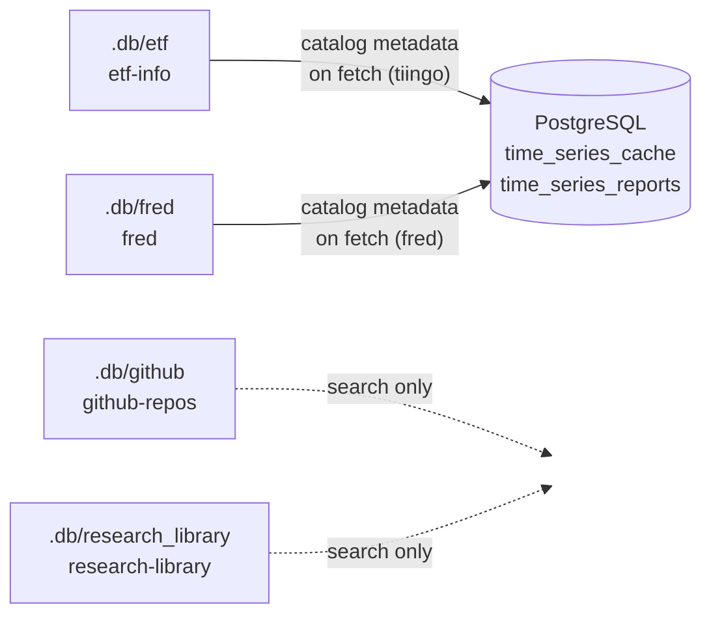

# YADA Documents

Design and reference documentation. For installation and how to run the stack, see the
[project README](../README.md).

## Architecture

- **[architecture.md](architecture.md)** — system context, runtime topology, the agent framework,
  model/cost strategy, request lifecycles, and the invariants that constrain changes.

## Data stores

YADA reads and writes five stores: one relational (its own data) and four ChromaDB catalogs
(external reference material).

| Document | Store | Holds |
| --- | --- | --- |
| [data-store-postgres.md](data-store-postgres.md) | PostgreSQL | Cached time-series observations and saved reports |
| [data-store-fred.md](data-store-fred.md) | `.db/fred` · `fred` | FRED series metadata (~145k) — the discovery index for economic data |
| [data-store-etf.md](data-store-etf.md) | `.db/etf` · `etf-info` | ETF / mutual-fund catalog (~36k) |
| [data-store-github.md](data-store-github.md) | `.db/github` · `github-repos` | Source code chunks from cloned repos (~415k) |
| [data-store-research-library.md](data-store-research-library.md) | `.db/research_library` · `research-library` | Papers, notes, posts, publications (~4.9k) |

### How they relate

The **ETF** and **FRED** catalogs do double duty: they back semantic search *and* supply the
catalog metadata lifted into PostgreSQL when a series is cached. That is what allows one set of
filter extractors to serve document search, cached-series listing, and report filtering alike —
see [architecture.md §7](architecture.md#7-filtering-architecture).

The **GitHub** and **research library** stores are retrieval corpora only; nothing from them
reaches the relational store.

