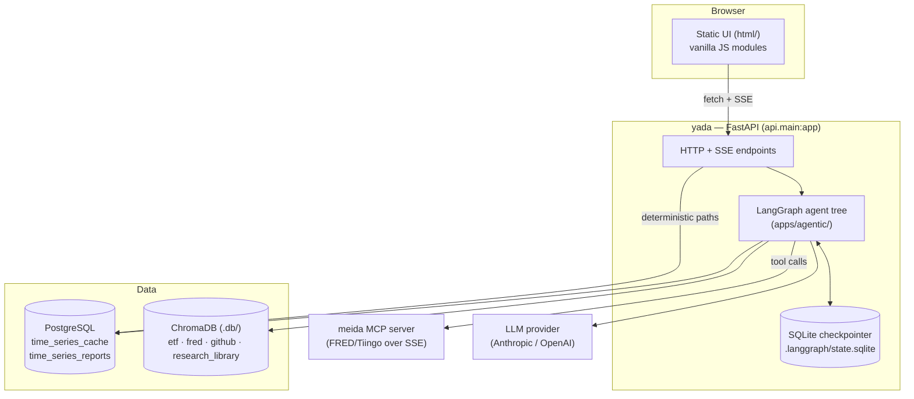
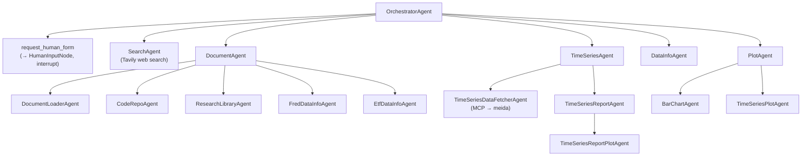
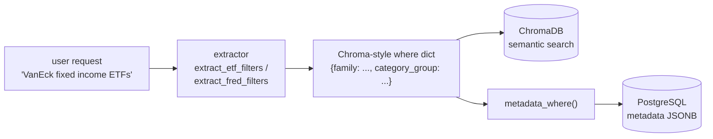
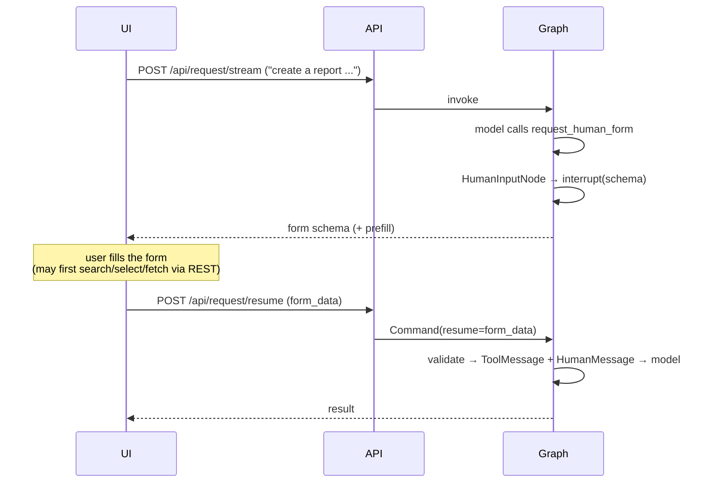

# YADA Architecture

This document describes how YADA is put together: its runtime topology, the agent
framework, the data model, and the request lifecycles that tie them together. It also
records the non-obvious invariants that constrain changes.

For installation, environment variables, and how to run the stack, see the
[README](../README.md) — this document does not repeat setup.

---

## Contents

1. [System context](#1-system-context)
2. [Runtime topology](#2-runtime-topology)
3. [The agent framework](#3-the-agent-framework)
4. [Agent tree](#4-agent-tree)
5. [Model strategy and cost control](#5-model-strategy-and-cost-control)
6. [Data layer](#6-data-layer)
7. [Filtering architecture](#7-filtering-architecture)
8. [Request lifecycles](#8-request-lifecycles)
9. [Frontend](#9-frontend)
10. [Invariants and gotchas](#10-invariants-and-gotchas)
11. [Testing](#11-testing)
12. [Extension points](#12-extension-points)

---

## 1. System context

YADA is the **agent and application layer** of a multi-repo system. It does not run standalone.

| Repo | Role | Relationship |
| --- | --- | --- |
| **navi** | Quantitative-finance library. Provides the `lib` package: logger, config, plots, statistical models, data-source API clients (FRED, Tiingo, BLS), and the SSE MCP client. | Installed editable via `-e ../navi` in `requirements.in`; imported throughout as `lib.*`. Must be a **sibling directory**. |
| **meida** | MCP data server (FastMCP). Exposes FRED/Tiingo fetch tools over SSE. | Reached at `MCP_URL` (default `http://localhost:8080/sse`, see `apps/agentic/core/constants.py`). Must be running for live data fetches. |
| **yada** | This repo. FastAPI app, LangGraph agent tree, web UI, caches. | Depends on both of the above. |

Because `lib` lives in **navi**, a change to logging, plotting, or a data client is a navi
change, not a yada change. Plot *rendering* primitives are split: generic figure helpers in
`lib.plots` (navi), YADA-specific plot builders in `apps/plots/`.

---

## 2. Runtime topology



Layers, top to bottom:

- **`html/`** — static frontend served at `/`. No build step, no framework.
- **`api/main.py`** — FastAPI: the conversational endpoints (streaming + resume) and a set of
  deterministic REST endpoints that bypass the agents entirely.
- **`apps/agentic/`** — the agent tree and its framework, document loaders, and DB models.
- **`apps/plots/`** — plot builders on top of `lib.plots`.
- **`alembic/`** — migrations for the PostgreSQL schema.
- **`clients/`** — offline CLI utilities (e.g. `clients/bin/fred.py` for FRED catalog exports).
- **`notebooks/`** — exploration and store-loading notebooks.
- **`tests/unit/`** — hermetic unit tests.

---

## 3. The agent framework

Everything in `apps/agentic/core/agents/` exists so individual agents are declarative.

### ReactNode — owns the LLM

`ReactNode` holds the model, the prompt, and the tool binding. It builds
`prompt.format_messages(messages=state["messages"])`, appends the shared `OUTPUT_STYLE` to the
system message, and invokes the tool-bound model with retry. An agent picks its model by passing
an `llm_factory`; the default is the full generation model.

### ReactAgent — owns the graph

`ReactAgent` is the abstract base owning the ReAct topology (`model → tools → model`, exit when
the model stops calling tools). Subclasses supply `create_prompt()` and a tool list. Agents that
need MCP tools declare `_mcp_tool_names`; discovery runs in `create()`.

### LinearAgent — single pass

`LinearAgent` overrides `_post_tools_target()` to return `END`, giving `model → tools → END`. The
`ToolMessage` becomes the final state message, so callers get **raw tool output with no extra LLM
round-trip** — used where a second model pass would only add cost and paraphrasing risk.

### tool_spec / ToolSpec — declarative tool documentation

Tools are annotated with a `ToolSpec` describing `primary_function`, `positive_examples`,
`negative_examples`, `requires_context`, and `suggests_followup`. This structured metadata is
rendered into the calling agent's prompt, so routing rules live next to the tool rather than
buried in a hand-maintained prompt.

`tool_spec(args_schema=...)` accepts `None`, which makes LangChain infer the schema from the
function signature — required for `InjectedState` tools (see [§10](#10-invariants-and-gotchas)).

### HumanInputNode — human-in-the-loop forms

A LangGraph node that calls `interrupt(schema)` to suspend the graph and hand a form schema to the
UI, then validates the submitted data on resume and injects it as a `HumanMessage`. It scans back
through state for the originating `request_human_form` call to recover the form type, its prefill,
and the `tool_call_id` (Anthropic requires every `tool_use` block be answered by a `tool_result`
before the conversation can continue).

Form models are registered in `apps/agentic/agents/forms.py` (`FORM_REGISTRY`).

### Checkpointer

A shared LangGraph checkpointer (`apps/agentic/core/checkpointer.py`) persists graph state to
`.langgraph/state.sqlite` via `AsyncSqliteSaver`, initialized on a dedicated background event
loop. Thread id = the UI session id. See [§10](#10-invariants-and-gotchas) for its durability
limits.

### CachingDataTool

Abstract base for data-source tools. It fetches a full series, writes it to `SeriesCache`, and
returns a **compact `SeriesRef` JSON string** rather than raw observations — keeping large
payloads out of the LLM context. Subclasses supply `source`, `_native_id`, `_fetch_raw`, and
`_obs_range` (`caching_fred_tool.py`, `caching_tiingo_tool.py`).

### ChromaRagAgent

Base for RAG search agents over ChromaDB collections, including where-filter normalization
(ChromaDB 1.0.x requires exactly one top-level operator, so flat multi-key dicts are wrapped in
`$and`).

---

## 4. Agent tree

A single orchestrator receives every conversational request and delegates. Each delegate invokes
its sub-agent with a fresh state and its own thread id, then returns the sub-agent's final message.



Responsibilities:

| Agent | Responsibility |
| --- | --- |
| **Orchestrator** | Routing only. Classifies the request, calls delegates (possibly several), and returns their output **verbatim**. |
| **DocumentAgent** | RAG over the ChromaDB stores: FRED metadata, ETF/fund info, GitHub code, research library. Also document loading. |
| **TimeSeriesAgent** | All time-series data fetching and report operations (create/get/list/plot/delete). |
| **DataInfoAgent** | Inspects what is already cached — series and report inventories, plus store metadata summaries. |
| **PlotAgent** | Ad-hoc charts from supplied data (bar charts, time-series plots). Report plots are **not** routed here. |
| **SearchAgent** | Web search for anything outside the local stores. |

---

## 5. Model strategy and cost control

Cost is dominated by how many LLM hops a request makes and how large each context is. Three
mechanisms keep it down.

### Model roles

`apps/agentic/core/llm_factory.py` exposes four factories, each with its own env override, all
resolving a provider from `LLM_MODEL_PROVIDER`:

| Factory | Env var | Purpose |
| --- | --- | --- |
| `agent_llm_model` | `AGENT_LLM_MODEL` | Generation and synthesis — the capable, expensive model. |
| `router_llm_model` | `ROUTER_LLM_MODEL` (falls back to scoring) | Pure routing/delegation. Temperature 0. |
| `filter_llm_model` | `FILTER_LLM_MODEL` | Structured filter extraction. Temperature 0 for determinism. |
| `scoring_llm_model` | `SCORING_LLM_MODEL` | Relevance scoring. |

Provider-specific handling lives here too — notably which Anthropic models reject sampling
parameters and which support adaptive thinking.

### Cheap models for routers

Agents that only decide *where to send a request* run on the router model:

`OrchestratorAgent`, `DocumentAgent`, `DocumentLoaderAgent`, `PlotAgent`, `TimeSeriesAgent`,
`TimeSeriesDataFetcherAgent`, `TimeSeriesReportAgent`.

`DataInfoAgent` deliberately stays on the **generation** model: it synthesizes metadata into prose
rather than routing, and a cheaper model measurably degraded its output.

### Deterministic (no-LLM) paths

The highest-value optimization. Frequent, well-specified operations bypass the agent tree entirely
and run as plain REST calls:

- **`POST /api/reports/{id}/plot`** — `render_report_plot()` resolves the report, refreshes and
  loads each series, picks the plot type from series count and distinct units
  (`_select_plot_type`), picks the axis scale from value span (`_axis_type_for`), and renders.
  Zero tokens; the UI reports zero cost.
- **`POST /api/series/fetch`**, **`GET /api/series/search`**, and the report CRUD endpoints — the
  UI drives these directly once the user has made a concrete choice.

The rule of thumb: **once the user has picked something specific, stop paying for inference.**
The agent tree is for interpreting intent, not for executing a known operation.

---

## 6. Data layer

### PostgreSQL (SQLAlchemy Core + Alembic)

Two tables, both reflected at startup rather than declared as ORM models.

**`time_series_cache`** — one row per cached series.

| Column | Notes |
| --- | --- |
| `cache_id` | UUID PK. Stable across re-fetches — the upsert deliberately does **not** touch it, so report references never break. |
| `source`, `native_id` | Namespaced identity (`fred:UNRATE`, `tiingo:IHY`). `native_id` alone can collide across sources. |
| `title`, `frequency` | Human-readable title; release frequency. |
| `observations` | JSONB — the full observation payload. |
| `metadata` | JSONB — see [§7](#7-filtering-architecture). |
| `observation_start`, `observation_end` | Date bounds of the stored data. |
| `ttl_days`, `expires_at` | Per-series freshness. Derived from frequency (a monthly series need not be re-fetched daily); market data defaults to ~1 day, FRED ~30. |

Reads accept `include_expired`. Reports pass `include_expired=True` so a **saved report always
plots**, even if the cache entry has aged out, while fetch paths re-fetch on expiry.

**`time_series_reports`** — a named grouping of cached series.

| Column | Notes |
| --- | --- |
| `report_id` | UUID PK. |
| `report_title`, `report_description` | Display fields; also the target of the picker's text search. |
| `time_series_info` | JSONB array of per-series records (`cache_id`, `title`, `source`, `native_id`, `frequency`, observation bounds, and the series' own `metadata`). |
| `metadata` | JSONB — the **merged** metadata of its series (GIN indexed). |
| `time_range_from`, `time_range_to` | Report window. A null `to` means "track the latest data". |

### ChromaDB

Persisted under `.db/`, one collection per catalog: **etf**, **fred**, **github**,
**research_library**. Loaders live in `apps/agentic/core/document_loaders/`. These stores back
both semantic search and the catalog metadata lifted into the relational cache.

---

## 7. Filtering architecture

A single filtering pipeline serves document search, cache/report listing, and the report picker.
The design goal: **one vocabulary, one representation, one translator.**



### Source-keyed metadata

Every cached series stores a **source-keyed** metadata dict:

```jsonc
{
  "units": "USD",
  "observation_count": 3824,
  "tiingo": {                                  // catalog fields, always lists
    "family": ["VanEck Asset Management"],
    "category_group": ["Fixed Income"],
    "category": ["Corporate Bonds"],
    "exchange": ["PCX"],
    "observation_start_int": [20110426],       // YYYYMMDD ints for range queries
    "observation_end_int": [20260710]
  }
}
```

Values are **always lists**, even for a single series, so a report's metadata merges uniformly:
`report_metadata_from_series()` lifts each series' source-keyed subset and unions the value lists
(`merge_source_metadata`). A report therefore matches a filter if **any** of its series does —
containment semantics fall out for free.

The catalog fields are lifted from the Chroma stores at fetch time (`series_metadata.py`) and are
deliberately **the same fields the document-search extractors already filter on**, which is what
allows the extractors to be reused unchanged.

### The translator

`apps/agentic/db/metadata_filter.py::metadata_where()` converts a Chroma-style where dict into a
SQLAlchemy condition over the JSONB column:

- **Catalog string fields** → list containment: `?` (has_key) for equality, `?|` (has_any) for `$in`.
- **Numeric `*_int` fields** → range via `jsonb_path_exists(..., '$."field"[*] ? (@ >= N)')`.
- Unknown fields are ignored; nothing applicable returns `None` (no filter).

### Source scoping

The ETF and FRED vocabularies overlap ("treasury", "government"), and the extractors ignore which
store the user named. Any caller that could span both stores must therefore **scope by source** —
a FRED request runs only the FRED extractor, an ETF request only the ETF one, and both are unioned
only when the request names no store. Where a store cannot be inferred, an explicit source still
constrains results to reports containing that store's data.

---

## 8. Request lifecycles

### A. Conversational request

`POST /api/request/stream` → orchestrator graph → SSE events (`status`, `result`, `meta`). The
`meta` event carries token counts and cost, polled from LangSmith when tracing is enabled.

The orchestrator's contract is **verbatim passthrough**: its final message must reproduce delegate
output exactly. A `passthrough` node bypasses the model entirely and assembles the answer with
`assemble_delegate_output()`, which selects, from the current turn only:

- **parallel tool calls** (independent asks) → every result, in order;
- **a sequential chain** (dependent steps) → only the last result.

### B. Human-in-the-loop form



`prefill` is how the orchestrator passes structured hints into a form — e.g. a list of
`{source, query}` searches for a compound report, or a `filter_query`/`filter_source` pair to
pre-filter the report picker. The UI may interpret a prefill by running its own REST calls before
resuming.

**Resume is guarded**: the endpoint checks for a pending interrupt first. Resuming a thread that
has none would otherwise restart the graph with empty input and fail with an opaque
"at least one message is required" 400 (see [§10](#10-invariants-and-gotchas)).

### C. Deterministic REST

No graph, no tokens. The UI calls these once the user has made a concrete choice — search series,
fetch into cache, CRUD a report, render a report plot.

---

## 9. Frontend

Static ES modules under `html/js/`, no build step:

| Module | Role |
| --- | --- |
| `app.js` | Bootstrap and layout. |
| `state.js` | Reactive state (VanJS): loading, status, session id, input value; `clearInput()`. |
| `api.js` | Streaming and resume requests, SSE parsing. |
| `forms.js` | All modal flows: series-selection table, create-report form, report picker, edit dialog. |
| `feed.js` | Result cards, token/cost footer (hidden when zero). |
| `markdown.js` | Markdown + syntax highlighting + MathJax rendering. |

Agent responses are **markdown with raw HTML passed through**, which is how server-rendered
fragments (plot images, the report legend table) reach the page. `markdown.js` pre-processes LaTeX
before handing off to `marked`, which has consequences for any `$` in generated output — see below.

---

## 10. Invariants and gotchas

These are the constraints that have already caused bugs. Violating them fails in confusing ways.

1. **`$` in generated HTML/markdown.** The client normalizes `$...$` to LaTeX before parsing. Two
   dollar signs anywhere in one line — e.g. two currency units in a table — make everything between
   them render as math, destroying the markup. **Encode `$` as `&#36;`** in server-generated
   fragments. MathJax itself is configured for `\(...\)` / `\[...\]` only, so a decoded `$` renders
   literally.

2. **Braces in agent prompts.** Prompts are `ChatPromptTemplate`s, so a literal `{` or `}` in
   prompt text is parsed as a template variable. Escape as `{{` / `}}`.

3. **`InjectedState` tools need `args_schema=None`.** Injection only works when LangChain infers
   the schema from the signature; an explicit schema breaks it silently. Used where a tool needs the
   user's **verbatim** request (delegation paraphrases it, which previously dropped filters).

4. **Checkpoint durability.** Interrupts do **not** reliably survive a process restart, so any
   `uvicorn --reload` (i.e. any source edit) drops pending forms. The resume endpoint detects the
   missing interrupt and returns an actionable message rather than a cryptic 400. Keep this in mind
   when editing files while a form is open.

5. **`cache_id` stability.** Re-fetching a series must preserve its `cache_id`, or saved reports
   break. The upsert explicitly avoids touching it.

6. **Reports read expired cache entries.** Report paths use `include_expired=True` so a saved
   report always plots; only fetch paths honor expiry.

7. **Verbatim output.** The orchestrator and intermediate routing agents must not reformat tool
   output — HTML fragments and markdown must survive intact. This is why the passthrough node
   exists and why routing agents carry explicit "copy exactly" instructions.

8. **`native_id` is not unique.** Always key by `source:native_id`.

---

## 11. Testing

`pytest tests/unit -q` (also wired as the **Unit Tests** target in `.vscode/launch.json`).

Unit tests are **hermetic** — no LLM, no database, no network. `tests/conftest.py` seeds
placeholder provider/API-key env vars so modules that build LLM clients at import time can be
imported offline, and quiets construction-time debug logging.

Coverage targets pure logic, the parts most likely to break silently:

| Area | Under test |
| --- | --- |
| Filtering | `_flatten`, `metadata_where` (containment, range, no-op cases) |
| Metadata | `merge_source_metadata`, `report_metadata_from_series` |
| Filter converters | `etf_filters_to_where`, `fred_filters_to_where` |
| Orchestration | `_content_to_text`, `assemble_delegate_output` |
| Plot selection | `_select_plot_type`, `_axis_type_for` |
| Forms | `HumanInputNode` message scanning, GitHub prefill parsing |
| Cache helpers | `_date_to_int` |

Markers `integration` (Postgres/Chroma) and `llm` (real model calls) are registered for a future
tier and are not run by default.

---

## 12. Extension points

**Add a data source.** Subclass `CachingDataTool` (`source`, `_native_id`, `_fetch_raw`,
`_obs_range`); add a TTL default; register the source in `series_fetch.py`. If it has a catalog,
add it to `_CATALOG` in `series_metadata.py` so its fields are lifted into series metadata, and to
`_CATALOG_FIELDS` in `metadata_filter.py` so they become filterable.

**Add an agent.** Subclass `ReactAgent` (or `LinearAgent` for raw single-pass tool output),
implement `create_prompt()`, list its tools, and pass `llm_factory=router_llm_model` if it only
routes. Expose it to a parent by writing a delegate tool annotated with a `ToolSpec`.

**Add a form.** Define a Pydantic model, register it in `FORM_REGISTRY` (`agents/forms.py`), teach
the orchestrator prompt when to request it (and what `prefill` to pass), and render it in
`forms.js` under a matching `formType` branch.

**Add a filterable field.** Extend the relevant `*Filters` model and its `*_filters_to_where`
converter, add the field to `_CATALOG` (so it is stored) and `_CATALOG_FIELDS` / `_RANGE_FIELDS`
(so it is queryable). Because every filter path shares this pipeline, the field becomes available
to document search, cache/report listing, and the report picker at once.
